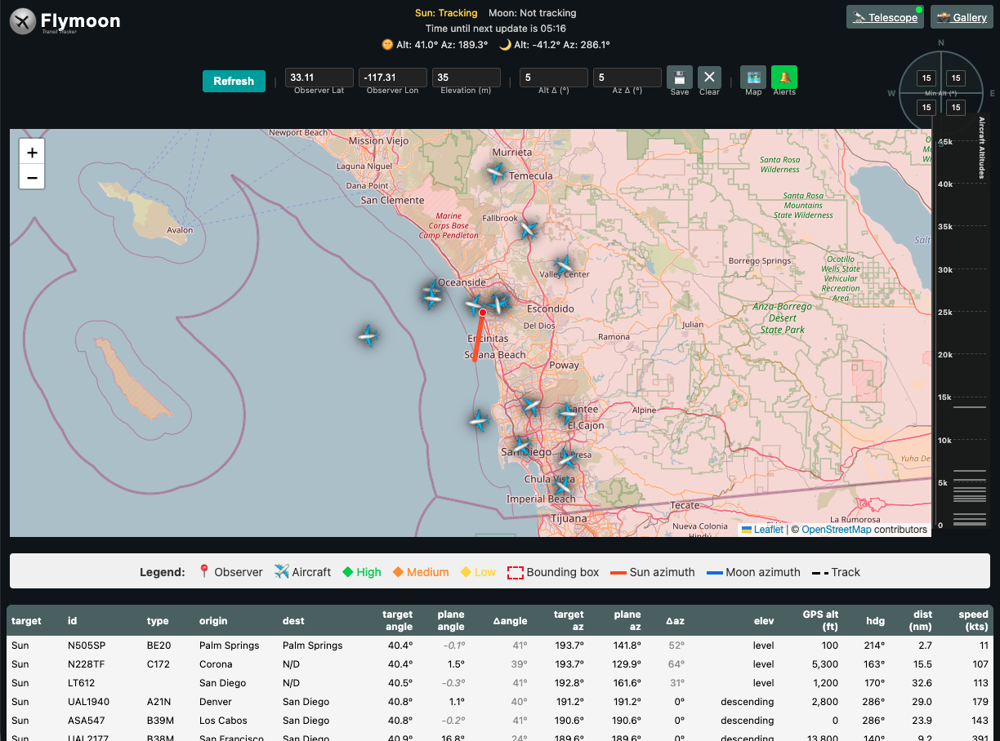

# 🌙 Flymoon - Aircraft Transit Tracker

Track aircraft transiting the Sun and Moon in real-time with automatic telescope photography.



## ✨ Features

- **Real-Time Transit Detection** - Monitor flights up to 15 minutes ahead for potential transits
- **Interactive Map** - Leaflet-based visualization with flight routes, altitude indicators, and azimuth arrows
- **Smart Probability Analysis** - Color-coded transit likelihood (🟢 High, 🟠 Medium, 🟡 Low)
- **Automatic Telescope Control** - Integrated Seestar S50 support with automatic recording
- **Telegram Notifications** - Get alerts when possible transits are detected
- **Flight Tracking** - Real-time data from FlightAware AeroAPI

## 🚀 Quick Start

### Prerequisites
- Python 3.9+
- FlightAware AeroAPI account ([Free Personal Tier](https://www.flightaware.com/aeroapi/signup/personal))

### Installation

**macOS/Linux:**
```bash
make setup
source .venv/bin/activate
```

**Windows:**
```cmd
python -m venv .venv
.venv\Scripts\activate
pip install -r requirements.txt
```

### Configuration

1. **Create `.env` file:**
   ```bash
   cp .env.mock .env
   ```

2. **Add your FlightAware API key:**
   ```
   AEROAPI_API_KEY=your_api_key_here
   ```

3. **Set your observer location:**
   ```
   OBSERVER_LATITUDE=33.111369
   OBSERVER_LONGITUDE=-117.310169
   OBSERVER_ELEVATION=0
   ```

4. **Optional: Set up Telegram or Telescope** - See [SETUP.md](SETUP.md) for detailed instructions

### Run

```bash
python app.py
```

Access the web interface at `http://localhost:8000` or the displayed LAN address (e.g., `http://192.168.1.100:8000`)

**Note:** The application runs with minimal console output by default. To enable detailed debug logging, see [SETUP.md](SETUP.md#troubleshooting).

## 📖 Documentation

- **[QUICKSTART.md](QUICKSTART.md)** - Fast-track setup guide
- **[SETUP.md](SETUP.md)** - Complete setup instructions (Telegram, Telescope)
- **[SECURITY.md](SECURITY.md)** - Security guidelines and best practices
- **[LICENSE](LICENSE)** - MIT License

## 🎯 How It Works

1. **Set Your Location** - Enter your coordinates (lat/lon/elevation)
2. **Define Search Area** - Draw or adjust bounding box on map
3. **Select Target** - Choose Sun, Moon, or Auto mode
4. **Monitor Transits** - View real-time flight data with transit predictions
5. **Automatic Recording** - Connected telescope automatically captures transits

### Transit Probability

Transits are ranked by the angular separation between aircraft and celestial target:

- **🟢 High** - ≤1° separation (direct transit very likely)
- **🟠 Medium** - ≤2° separation (near miss, worth recording)
- **⚪ Low** - ≤3° separation (possible distant transit)

## 🗺️ Map Features

- **Altitude Overlay** - Thin horizontal bars show aircraft altitude (clickable)
- **Route Display** - Click any indicator to show planned route and historical track
- **Azimuth Arrows** - Visual direction indicators to Sun/Moon
- **Bounding Box** - Adjustable search area (drag corners to resize)

## ⚙️ Advanced Features

### Auto-Refresh Mode
Set automatic checks every N minutes with sound alerts for detected transits

### Telescope Integration
Automatic video recording when transits are detected (Seestar S50 supported)

### Telegram Notifications
Receive instant alerts on your phone for medium/high probability transits

## 🤖 Headless/Background Mode

For automated monitoring without the web interface, use the standalone scripts:

### `monitor_transits.py` - Pushbullet Notifications
Monitors for high-probability transits and sends Pushbullet push notifications:

```bash
python3 monitor_transits.py \
  --latitude YOUR_LATITUDE \
  --longitude YOUR_LONGITUDE \
  --elevation YOUR_ELEVATION \
  --target sun \
  --interval 15 \
  --warning 5
```

**Requirements:**
- `PUSH_BULLET_API_KEY` in `.env` ([Get free API key](https://www.pushbullet.com/#settings/account))
- `AEROAPI_API_KEY` in `.env`

**Options:**
- `--target`: `sun`, `moon`, or `auto` (default: `sun`)
- `--interval`: Check interval in minutes (default: 15 or from `.env` `MONITOR_INTERVAL`)
- `--warning`: Minutes before transit to send urgent notification (default: 5)

### `transit_capture.py` - Automated Telescope Recording
Automatically controls Seestar telescope or sends Telegram notifications:

```bash
# Automatic mode (tries Seestar control first, falls back to Telegram)
python3 transit_capture.py \
  --latitude YOUR_LATITUDE \
  --longitude YOUR_LONGITUDE \
  --target sun

# Force manual mode (Telegram notifications only)
python3 transit_capture.py \
  --latitude YOUR_LATITUDE \
  --longitude YOUR_LONGITUDE \
  --target sun \
  --manual

# Test Seestar connection
python3 transit_capture.py --test-seestar
```

**Requirements:**
- **Automatic mode**: `ENABLE_SEESTAR=true`, `SEESTAR_HOST` in `.env`
- **Manual mode**: `TELEGRAM_BOT_TOKEN`, `TELEGRAM_CHAT_ID` in `.env` (see [SETUP.md](SETUP.md))

Both scripts can run in the background (append `&` on Unix/Mac or use Task Scheduler on Windows) and will continuously monitor for transits.

### macOS Application Bundle

For macOS users, a double-clickable `.app` is available:

1. **Build the app** (first time only):
   ```bash
   ./build_mac_app.sh
   ```

2. **Configure** `.env` with `TELEGRAM_BOT_TOKEN` and observer location

3. **Double-click** `Transit Monitor.app` and select your target

The app provides a GUI for configuration and runs `transit_capture.py` in the background. Logs are written to `/tmp/transit_monitor.log`.

## 🔧 Technical Details

### Transit Detection Algorithm

Flymoon predicts aircraft transits using a multi-step process:

1. **Flight Data Acquisition** - Queries FlightAware AeroAPI for all aircraft within the configured bounding box
2. **Position Prediction** - Projects each aircraft's position up to 15 minutes ahead assuming constant velocity and heading
3. **Celestial Tracking** - Calculates Sun/Moon altitude and azimuth using Skyfield and JPL ephemeris data (de421.bsp)
4. **Angular Separation** - Uses numerical optimization to find the minimum angular distance between aircraft path and celestial target
5. **Probability Classification** - Ranks transits using angular separation thresholds:
   - **🟢 High**: ≤1° separation (direct transit very likely)
   - **🟠 Medium**: ≤2° separation (near miss, worth recording)
   - **⚪ Low**: ≤3° separation (possible distant transit)

The algorithm assumes a 1° target size (0.5° for Sun/Moon diameter + 0.5° margin for near misses). Thresholds are configurable via `ALT_THRESHOLD` and `AZ_THRESHOLD` environment variables.

**Key Assumptions:**
- Aircraft maintain constant velocity and heading over the prediction window
- Prediction accuracy decreases beyond 5-10 minutes due to flight path changes
- Actual transit duration is typically 0.5-2 seconds

### Data Sources
- **Flight Data**: FlightAware AeroAPI
- **Celestial Calculations**: Skyfield with JPL ephemeris (de421.bsp)
- **Map Tiles**: OpenStreetMap
- **Map Library**: Leaflet 1.9.4 (self-hosted for security)

## 📊 Requirements

- **API Rate Limits**: FlightAware Personal tier allows 10 queries/minute
- **Network**: LAN access for telescope control (if using)
- **Storage**: ~50MB per transit video (if recording enabled)

## 🔒 Security

Flymoon binds to `0.0.0.0:8000` by default (accessible on your local network). Gallery write operations require authentication:

```bash
# Generate secure token
python3 -c "import secrets; print(secrets.token_urlsafe(32))"

# Add to .env
GALLERY_AUTH_TOKEN=your_token_here
```

**Important**: Do not expose Flymoon to the internet without additional security measures. See [SECURITY.md](SECURITY.md) for details.

## 🤝 Contributing

Contributions welcome! Please open an issue or pull request for:
- Bug fixes
- Feature enhancements
- Documentation improvements

**Share Your Transits!** Post your transit photos in [this issue](https://github.com/dbetm/flymoon/issues/21)

## 📝 Credits

Created with contributions from the Flymoon community. Special thanks to all contributors and transit photographers!

## 📄 License

MIT License - See [LICENSE](LICENSE) for details

---

**Pro Tip**: Use Flightradar24 alongside Flymoon for additional flight tracking context.
