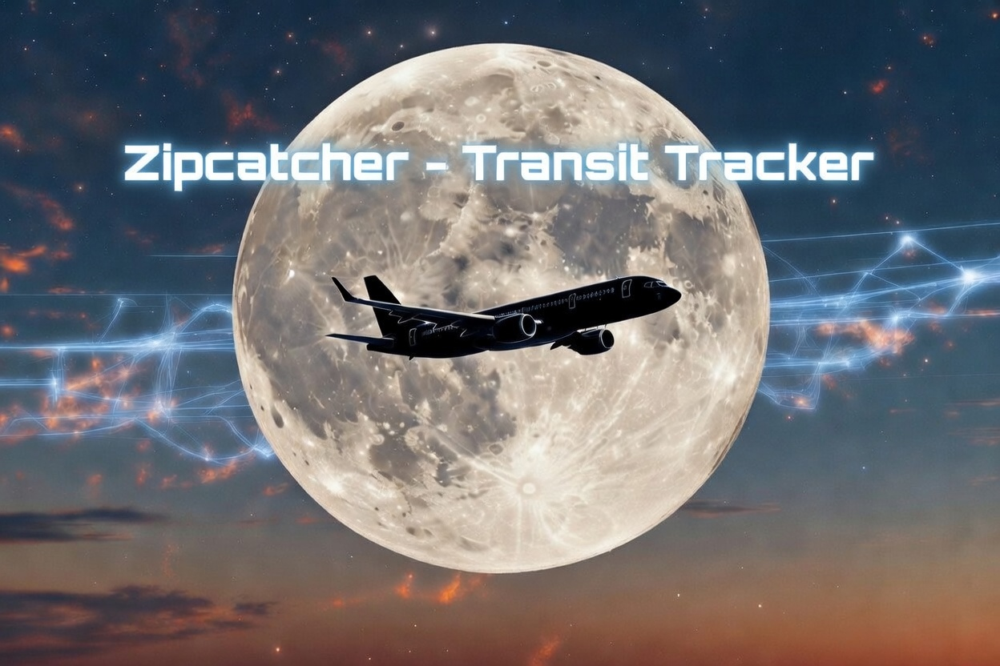
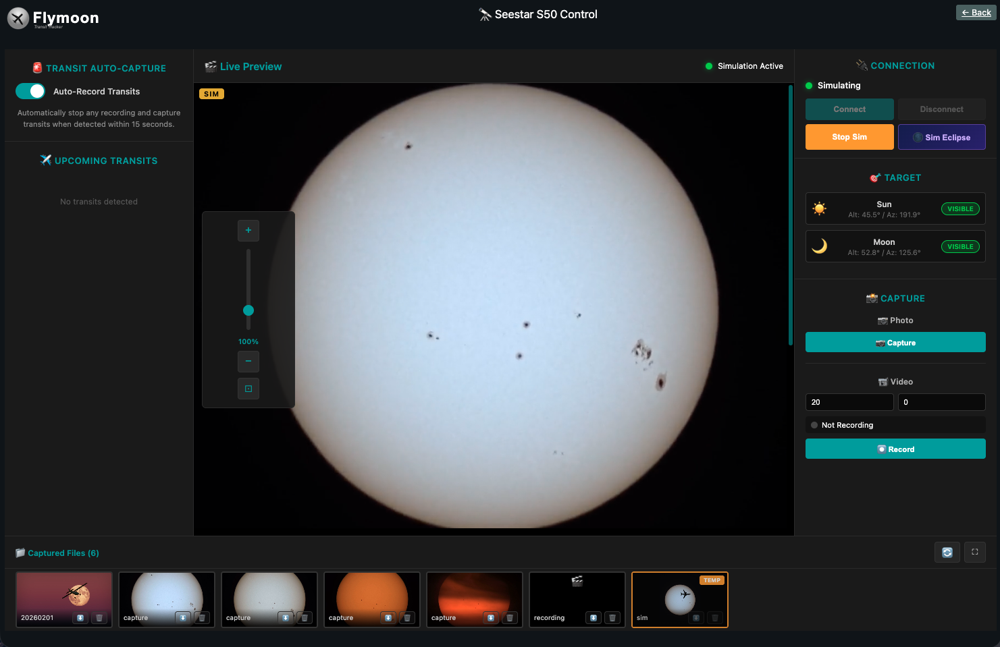
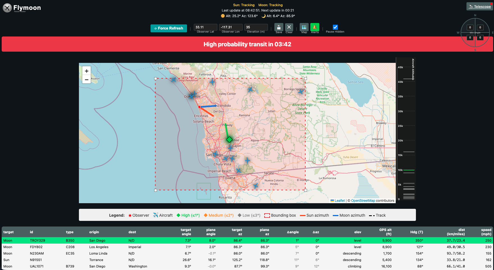
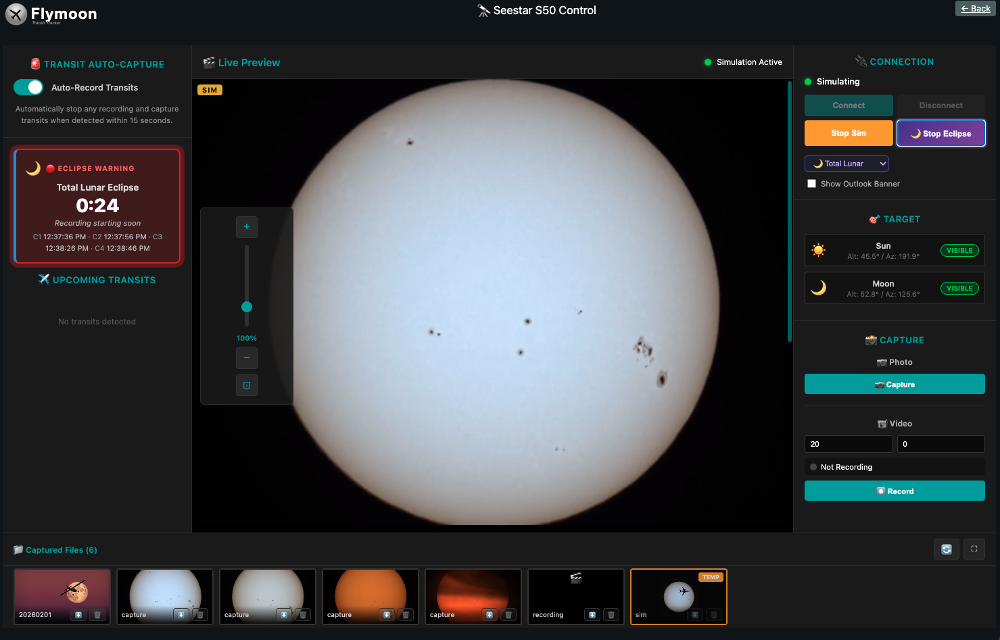

# 🌙 Flymoon — Aircraft Transit Tracker

**Predict, detect, and photograph aircraft crossing the Sun or Moon in real time.**

<p align="center">
  
</p>


---

## ✨ What Flymoon Does

Flymoon combines real-time flight data, high-precision celestial mechanics, and telescope automation to give you everything you need to capture an aircraft transiting the Sun or Moon--even an eclipse timelapse:

- Predicts which flights will pass close to the Sun or Moon up to **15 minutes ahead**
- Shows flight paths, altitudes, and transit probability on an **interactive map**
- Optionally controls a **Seestar S50 telescope** to start recording automatically before the transit and stop after
- Analyses recorded video to produce **annotated composite images** showing the aircraft's path across the disc
- Sends **Telegram alerts** when a high-probability transit is detected
- Runs **headlessly overnight** on a Mac, Linux box, or Windows PC

<p align="center">
  
</p>

---

## 🚀 Quick Start

### Prerequisites
- Python 3.9+
- FlightAware AeroAPI key ([free personal tier](https://www.flightaware.com/aeroapi/signup/personal))

### Install

Full setup instructions (Mac, Windows, Linux) → **[SETUP.md](SETUP.md)**

---

## 🎯 Transit Detection

### Prediction Algorithm

1. **Flight acquisition** — queries FlightAware AeroAPI for all aircraft within the configured bounding box
2. **Position projection** — extrapolates each aircraft's position up to 15 minutes ahead using constant velocity and heading
3. **Celestial tracking** — computes Sun/Moon altitude and azimuth with Skyfield + the JPL DE421 ephemeris, accounting for atmospheric refraction
4. **Angular separation** — numerical optimisation finds the moment of closest approach between the aircraft path and the celestial disc
5. **Probability classification** — ranks each candidate by true on-sky angular separation (azimuth differences cosine-weighted by target altitude to correct for geometric compression near the zenith):

| Indicator | Separation | Meaning |
|-----------|-----------|---------|
| 🟢 High | ≤ 1.5° | Direct transit very likely |
| 🟠 Medium | ≤ 2.5° | Near miss — worth recording |
| ⚪ Low | ≤ 3.0° | Possible transit |

### Real-Time Video Detection

When the telescope is connected and running, **TransitDetector** monitors the live RTSP stream frame-by-frame, detecting aircraft silhouettes crossing the disc in real time using computer-vision coherence tracking. Detections trigger an immediate recording bookmark and are logged to the gallery.

### Post-Capture Analysis

**TransitAnalyzer** processes recorded video after each session to produce:
- A **composite image** showing every frame where the aircraft was on the disc, blended over a clean reference background
- A **sidecar legend** annotating the track with frame times, angular velocity, and disc entry/exit positions

### Detection Tester (Inject / Sweep / Validate)

In the telescope sidebar (under **Live Detection**), the **Detection Tester** card gives quick feedback on missed-vs-detected transits:

- **Inject** — inserts a synthetic transit and checks whether the analyzer catches it (quick pipeline sanity check)
- **Sweep** — runs a size × speed matrix and reports how many combinations are detected
- **Validate** — runs the analyzer over your captured MP4 files and reports events found per file

Mode selector:

- **Default** — production-like thresholds (stricter; fewer false positives)
- **Sensitive** — lower speed/travel gates and static-filter disabled (better at slower birds/balloons, more false positives)

How to use the sweep output:

- If only fast columns (e.g. 200/300 px/s) are green, your setup is tuned for fast transits only
- If Default misses many cells, switch to **Sensitive** and rerun
- If Sensitive is still low, run **Validate** on known-transit clips and tune thresholds further

Recommended sequence:

1. Run **Inject** (Default) to verify the pipeline works
2. Run **Sweep** (Default), then **Sweep** (Sensitive)
3. Run **Validate** on known real-transit clips
4. Keep **Default** for daily use; use **Sensitive** when checking for slow/ambiguous objects

---

## 🗺️ Map Interface

<p align="center">
  
</p>

- **Per-quadrant minimum altitude** — set independent minimum angles for North, East, South, and West to mask out trees, rooftops, or other obstructions; only flights near the Sun/Moon when it is above your local horizon count
- **Altitude bars** — thin horizontal bars on each flight indicator show cruising altitude at a glance
- **Route & track overlay** — click any indicator to show the planned route ahead and historical track behind
- **Azimuth arrows** — on-map arrows point toward the Sun and Moon from your observer position
- **Traffic density heatmap** — toggle 🔥 to reveal accumulated flight corridors built up across polling cycles (persists across sessions in browser storage, capped at 2,000 points)
- **Adjustable bounding box** — drag the corners to resize the search area

---

## 🔭 Telescope Integration

Flymoon connects directly to the Seestar S50 over TCP — no bridge app required.

- **Auto-discovery** — scans the local subnet to find the scope's IP automatically
- **Solar & lunar modes** — switches the scope to the correct imaging mode for the selected target
- **Automatic recording** — starts video a configurable number of seconds before the predicted transit and stops after (defaults: 10 s pre/post buffer)
- **Live preview** — MJPEG stream from the scope shown directly in the browser panel
- **Smart reconnection** — if the scope drops off the network overnight, Flymoon waits to reconnect until the selected target is back above the minimum altitude you set in the UI quadrant controls, avoiding noisy reconnect attempts in the middle of the night
- **Capture gallery** — browsable gallery of all recorded clips and analysed composites

<p align="center">
  
</p>

---

## 📱 Notifications

**Telegram** — instant phone alerts for medium and high probability transits, including predicted transit time, flight details, and angular separation.

---

## 🤖 Headless / Background Mode

### `monitor_transits.py` — Pushbullet notifications
```bash
python3 monitor_transits.py \
  --latitude 51.5 --longitude -0.12 --elevation 10 \
  --target sun --interval 15
```

### `transit_capture.py` — Telescope control or Telegram fallback
```bash
# Fully automated (Seestar + Telegram)
python3 transit_capture.py --latitude 51.5 --longitude -0.12 --target sun

# Notifications only
python3 transit_capture.py --latitude 51.5 --longitude -0.12 --target sun --manual
```

Both scripts run continuously in the background and handle their own scheduling.

### macOS App Bundle

```bash
./build_mac_app.sh        # builds Transit Monitor.app
```

Double-click `Transit Monitor.app`, select your target, and leave it running. Logs go to `/tmp/transit_monitor.log`.

### Windows System Tray

```cmd
pip install -r requirements-windows.txt
python windows_monitor.py
```

Tray icon colours: **gray** = idle · **green** = monitoring · **orange** = transit detected · **red** = error.

---

## ⚙️ Configuration

Copy `.env.mock` to `.env` and fill in:

| Variable | Purpose |
|----------|---------|
| `AEROAPI_API_KEY` | FlightAware API key (required) |
| `OBSERVER_LATITUDE / LONGITUDE / ELEVATION` | Your location |
| `LAT/LONG_LOWER_LEFT / UPPER_RIGHT` | Flight search bounding box |
| `TELEGRAM_BOT_TOKEN / CHAT_ID` | Telegram alerts (optional) |
| `ENABLE_SEESTAR / SEESTAR_HOST` | Telescope control (optional) |
| `SEESTAR_PRE_BUFFER / POST_BUFFER` | Recording window in seconds (default: 10) |
| `FLYMOON_BROWSER` | Startup browser preference (`default` or `chrome`) |
| `FLYMOON_NO_BROWSER` | Disable browser auto-open on startup when set |
| `SOLAR_TIMELAPSE_AUTO_RESUME` | Auto-resume today's solar timelapse after reconnect/restart (`true`/`false`) |
| `SOLAR_TIMELAPSE_INTERVAL` | Default seconds between auto-resumed timelapse frames (default: 120) |
| `SOLAR_TIMELAPSE_STABILIZE` | Stabilize timelapse frames to reduce atmospheric jitter (`true`/`false`) |
| `SOLAR_TIMELAPSE_STABILIZE_MAX_SHIFT / SOLAR_TIMELAPSE_STABILIZE_SMOOTHING` | Stabilizer clamp (px) and smoothing (0..1) |
| `MIN_TARGET_ALTITUDE` | Fallback minimum altitude for reconnect logic when the browser hasn't connected yet (default: 10°) |

Run `python3 src/config_wizard.py --setup` for interactive validation of all settings.

---

## 📖 Documentation

| File | Contents |
|------|---------|
| [QUICKSTART.md](QUICKSTART.md) | Fastest path to first detection |
| [SETUP.md](SETUP.md) | Full setup — Telegram, Telescope, Windows |
| [SECURITY.md](SECURITY.md) | Securing the server on a LAN |
| [ATTRIBUTION.md](ATTRIBUTION.md) | Open-source library credits |

---

## 🔒 Security

Flymoon binds to `0.0.0.0:8000` by default (LAN-accessible). Gallery write operations require a `GALLERY_AUTH_TOKEN` in `.env`. See [SECURITY.md](SECURITY.md) before exposing the server beyond your local network.

---

## 🤝 Contributing

Issues and pull requests welcome — especially transit photographs!

**Share your captures** → [GitHub Discussions / Issue #21](https://github.com/dbetm/flymoon/issues/21)

---

## 📝 Credits

| Component | Project | Licence |
|-----------|---------|---------|
| Interactive map | [Leaflet 1.9.4](https://leafletjs.com) © Vladimir Agafonkin | BSD 2-Clause |
| Bounding-box drawing | [Leaflet.Editable](https://github.com/Leaflet/Leaflet.editable) © Yoann Aubineau | MIT |
| Traffic heatmap | [Leaflet.heat](https://github.com/Leaflet/Leaflet.heat) © Vladimir Agafonkin | MIT |
| Celestial calculations | [Skyfield 1.49](https://rhodesmill.org/skyfield/) © Brandon Rhodes | MIT |
| Web framework | [Flask 3.0.3](https://flask.palletsprojects.com) © Pallets | BSD 3-Clause |
| Telegram alerts | [python-telegram-bot 21.0](https://python-telegram-bot.org) | LGPLv3 |
| JPL Ephemeris | [DE421](https://naif.jpl.nasa.gov/pub/naif/generic_kernels/spk/planets/) — NASA/JPL | Public Domain |
| Free flight positions | [OpenSky Network](https://opensky-network.org) | [Terms](https://opensky-network.org/about/terms-of-use) |
| Aviation chart overlay | [OpenAIP](https://www.openaip.net) | CC BY-NC-SA 4.0 |

See [ATTRIBUTION.md](ATTRIBUTION.md) for full licence texts.

---

## 📄 Licence

MIT — see [LICENSE](LICENSE)

---

*Pro tip: open Flightradar24 alongside Flymoon for extra situational awareness when a high-probability transit is approaching.*
